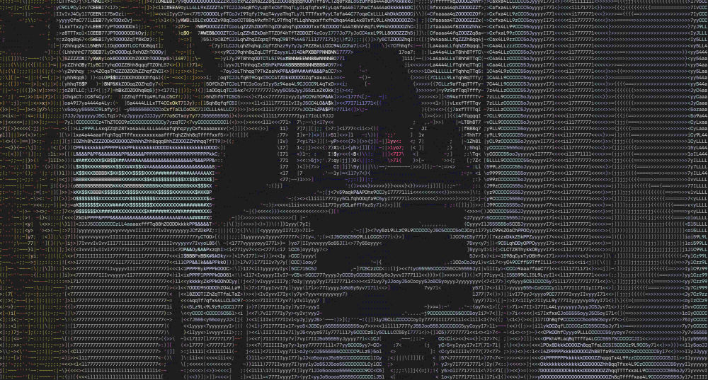

# movart

This work is based on previous work [here](https://github.com/boriwo/art). While _art_ does only ASCII conversion
for static images, movart does the same for mp4 encoded videos. Just like before, you can choose between monochrome,
gray scale and color characters. Movart also supports playing the audio stream if desired using the _-audio_ option.



Example Usage:

```
./movart -file video.mp4

./movart -file video.mp4 -audio

./movart -file video.mp4 -mode gray -audio

./movart -file video.mp4 -mode color -audio

./movart -file video.mp4 -alphabet "*\. " -fontfile courier_prime.ttf
```

Libraries used for this project:

_Reisen_

This project would not have been possible without _reisen_, a simple library to extract video and audio 
frames from media containers.

* https://github.com/zergon321/reisen

* https://golangrepo.com/repo/zergon321-reisen-go-video

Other useful reading:

_Ebiten 2D Game Engine_

* https://github.com/hajimehoshi/ebiten

_Disintegration Imaging Library_

* https://github.com/disintegration/imaging

_OpenCV 4 Computer Vision Library_

* https://github.com/hybridgroup/gocv


